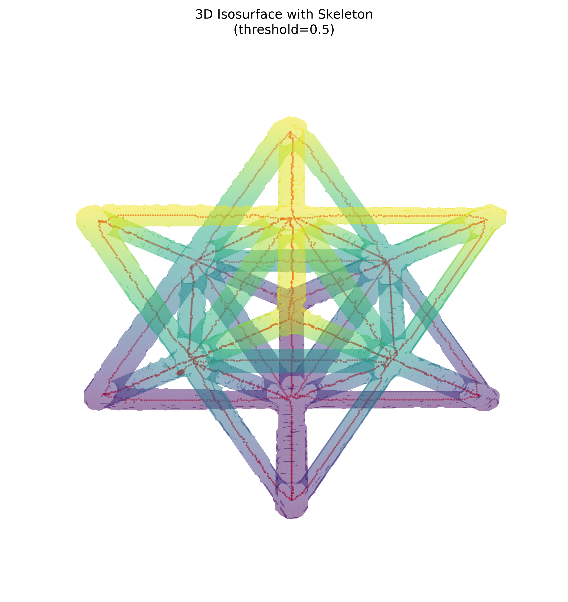
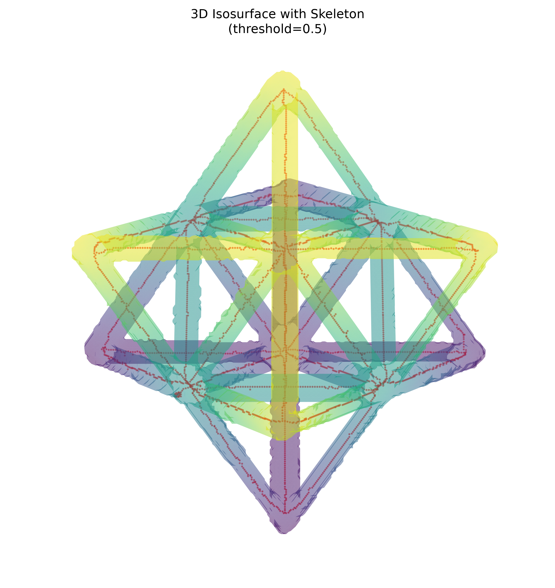

# NDE Report: Unit Cell

Generated: 2026-07-20

## Source Files

| Role | File |
| --- | --- |
| Original volume | `data/unitcell/unitcell.npy` |
| Segmented mask | `data/unitcell/unitcell_threshold_0p01_segmentation.npy` |
| Skeleton | `data/unitcell/unitcell_threshold_0p01_skeleton.npy` |

All three arrays are shape-compatible at `(256, 256, 256)`.

## Summary Table

| Metric | Original Volume | Segmented Mask | Skeleton |
| --- | ---: | ---: | ---: |
| Array shape | `(256, 256, 256)` | `(256, 256, 256)` | `(256, 256, 256)` |
| Data type | `float32` | `bool` | `bool` |
| Total voxels | 16,777,216 | 16,777,216 | 16,777,216 |
| Active voxel count | 12,801,024 nonzero | 622,182 ROI | 3,126 skeleton |
| Active fraction | 76.300% nonzero | 3.708% ROI | 0.0186% skeleton |
| Intensity minimum | -0.003129 | n/a | n/a |
| Intensity maximum | 0.015258 | n/a | n/a |
| Mean intensity | 0.000539 | 0.012151 inside mask | n/a |
| Background mean intensity | n/a | 0.000092 outside mask | n/a |
| Endpoint count | n/a | n/a | 26 |
| Branch point count | n/a | n/a | 142 |
| Mean skeleton neighbor degree | n/a | n/a | 2.083 |
| Isolated skeleton voxels | n/a | n/a | 0 |

## Visual Gallery

### View A: Elevation 30.0, Azimuth 45.0

### View B: Elevation 60.0, Azimuth 45.0

## Analysis

The segmented mask isolates 622,182 voxels, or 3.708% of the full volume. The mean intensity inside the mask is 0.012151, much higher than the outside-mask mean of 0.000092, which indicates that the thresholded ROI is well aligned with the brighter structural material in the original CT volume.

The skeleton contains 3,126 voxels and is fully contained within the mask: all 3,126 skeleton voxels overlap the segmented ROI, with 0 skeleton voxels outside the mask. This supports good mask-to-skeleton alignment. The skeleton has 26 endpoints and 142 branch points using 26-neighborhood connectivity, consistent with a connected lattice-like unit cell containing multiple junctions and no isolated skeletal fragments.
